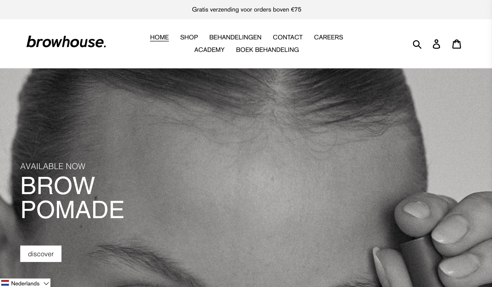
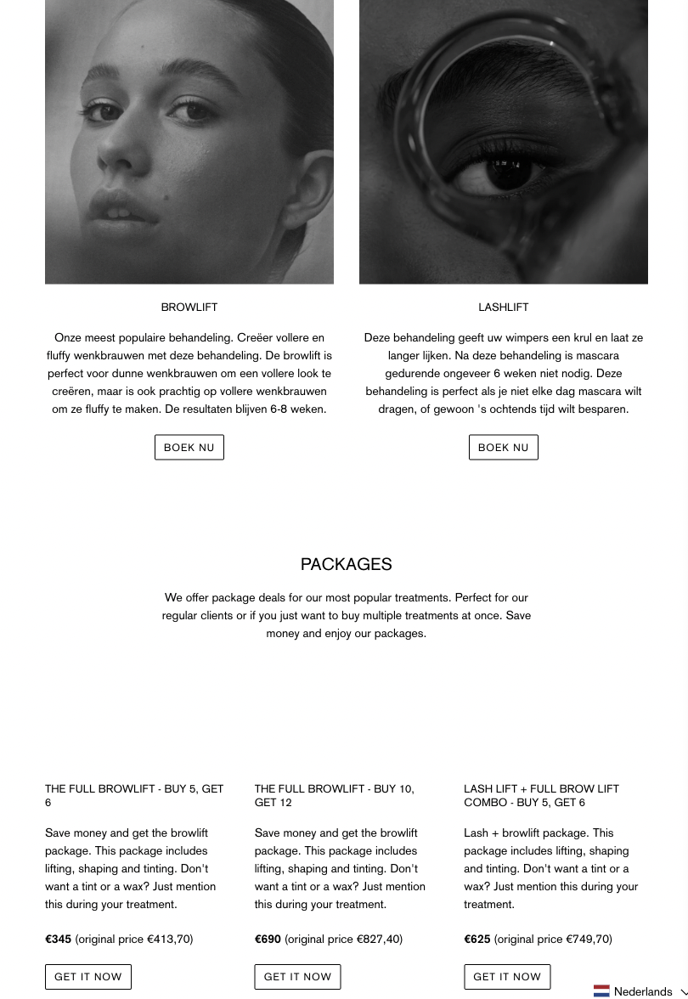
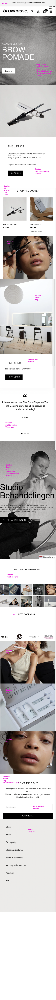
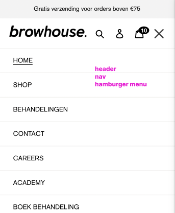
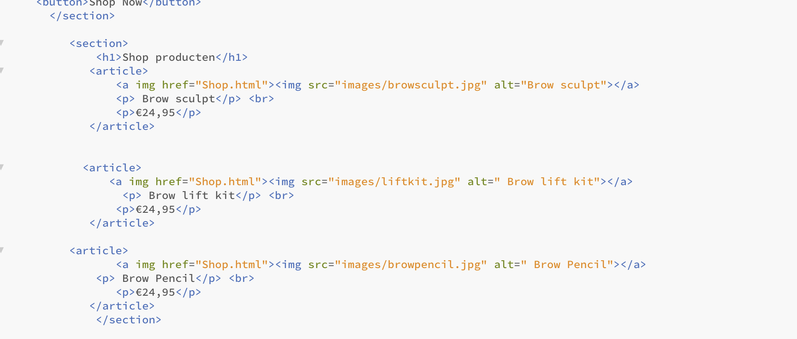
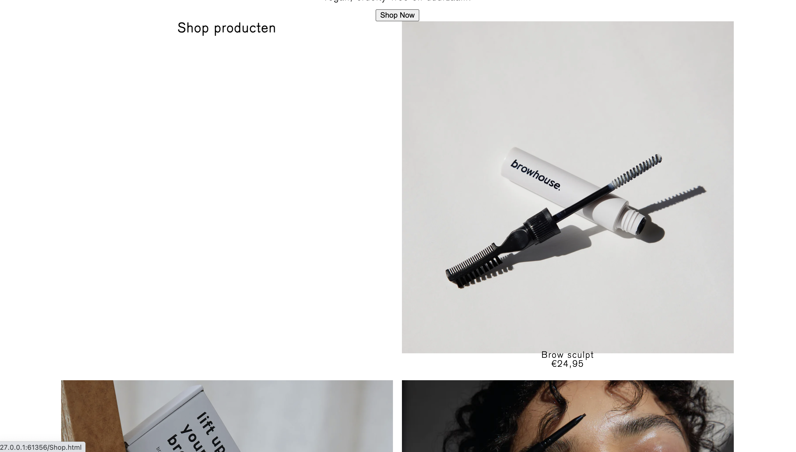
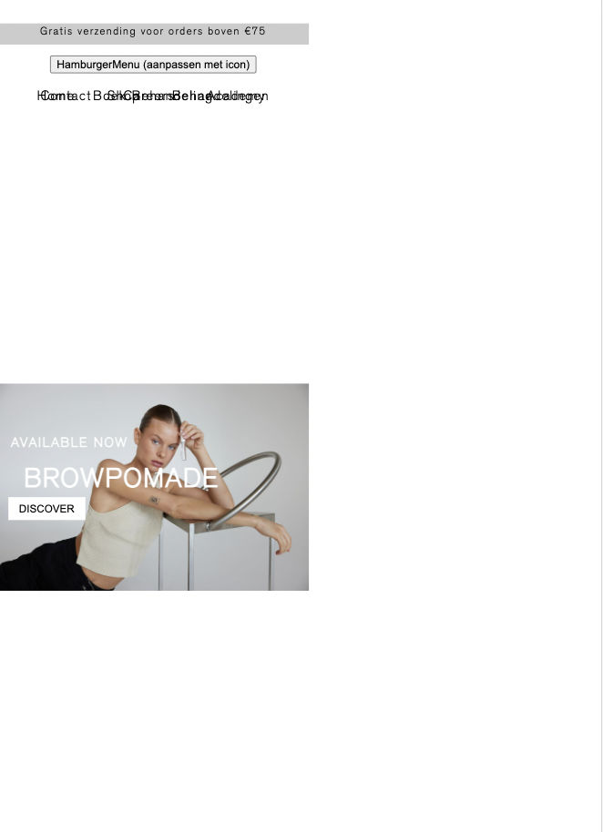
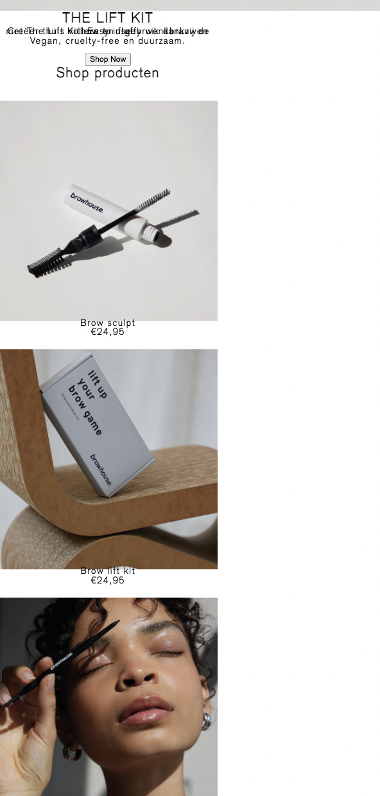

# Procesverslag
Markdown is een simpele manier om HTML te schrijven.  
Markdown cheat cheet: [Hulp bij het schrijven van Markdown](https://github.com/adam-p/markdown-here/wiki/Markdown-Cheatsheet).

Nb. De standaardstructuur en de spartaanse opmaak van de README.md zijn helemaal prima. Het gaat om de inhoud van je procesverslag. Besteedt de tijd voor pracht en praal aan je website.

Nb. Door *open* toe te voegen aan een *details* element kun je deze standaard open zetten. Fijn om dat steeds voor de relevante stuk(ken) te doen.

## Jij

  
uitwerken voor kick-off werkgroep

  ### Auteur:
 Zineb Ahaddout

  #### Je startniveau:
 Blauw / beginner

  #### Je focus:
 Responsive
 

## Je website

  
uitwerken voor kick-off werkgroep

  ### Je opdracht:
 https://www.browhouse.nl/nl

  #### Screenshot(s) van de eerste pagina (small screen): 
 Homepage 
  

  #### Screenshot(s) van de tweede pagina (small screen):
  Behandelingen  
  
 

## Toegankelijkheidstest 1/2 (week 1)

  
uitwerken na test in 2e werkgroep

  ### Bevindingen
 Ik heb de website browhouse.nl bekeken en mijn bevindingen zijn als volgt:

Ik merkte op dat de site wellicht niet volledig toegankelijk is voor mensen met beperkingen. De grote afbeeldingen lijken de snelheid van het browsen te belemmeren, waardoor het navigeren door de site enige tijd in beslag kan nemen. Het lijkt erop dat het proces om een product af te rekenen wel relatief snel en gemakkelijk verloopt.

Ik denk dat de site gebruiksvriendelijker kan worden gemaakt door de afbeeldingen te optimaliseren en de bestandsgrootte te verkleinen. Dit kan helpen bij het verbeteren van de algehele gebruikerservaring en de laadtijd van de pagina's.

Daarnaast zou het nuttig kunnen zijn om andere aspecten van webtoegankelijkheid te overwegen, zoals het gebruik van goed gestructureerde kopjes, het toevoegen van alternatieve tekst aan afbeeldingen en het vermijden van informatie die uitsluitend visueel wordt gepresenteerd.

Het implementeren van deze verbeteringen zou kunnen bijdragen aan een meer inclusieve ervaring voor alle bezoekers van de website

## Breakdownschets (week 1)

  
uitwerken na afloop 3e werkgroep

  ### de hele pagina: 
  

  ### dynamisch deel (bijv menu): 
  

  ### wellicht nog een dynamisch deel (bijv filter): 
  

## Voortgang 1 (week 2)

  
uitwerken voor 1e voortgang

  ### Stand van zaken
  Het maken van de HTML voor mijn project vond ik in eerste instantie vrij eenvoudig. Ik had de neiging om meteen met de CSS aan de slag te gaan, omdat ik moeite had om me voor te stellen hoe de uiteindelijke pagina eruit zou moeten zien. Mijn doel was om het zo snel mogelijk te laten lijken op de originele website, maar dit leidde tot veel tijdverlies, omdat ik vastliep in mijn CSS. Uiteindelijk besloot ik om door te gaan met het verfijnen van de HTML en de CSS even te laten rusten. Dit gaf me meer duidelijkheid en controle over het uiteindelijke resultaat van mijn project.
  
  

  ### Agenda voor meeting
  samen met je groepje opstellen

Zineb:       
          
  - Is het handig om table en Article te gebruiken?
  - Zit mijn breakdown schets goed in elkaar?
  - Mijn CSS is niet goed gekoppeld 
 - Wat kan ik het beste gebruiken voor de shop artikelen?
 
 

  ### Verslag van meeting
 Tijdens het voortgangsgesprek zijn de volgende belangrijke punten besproken die relevant zijn voor mijn procesverslag:

- Het gebruik van  om elementen te verbergen die wel door een screenreader moeten worden voorgelezen.
- Het creëren van een formulier met specifieke elementen zoals input type="email". Het werd benadrukt dat formulieren vaak complex kunnen zijn en extra aandacht vereisen.
- De implementatie van een knop voor het hamburgermenu die boven de navigatie moet worden geplaatst.
- Het gebruik van de a[aria-current="page"] attribuut om aan te geven aan een screenreader en zoekmachines op welke pagina de gebruiker zich bevindt. Dit kan bijvoorbeeld worden toegepast in een hamburgermenu, en de visuele weergave kan worden aangepast met behulp van CSS.
- Het advies om geen <article> elementen te gebruiken, maar eerder te kiezen voor <list> of <section>. Er werd benadrukt dat <article> een bijzonder element is en dat in dit geval <list> beter geschikt is voor de shop.
    
Deze besproken punten vormen belangrijke richtlijnen voor het verdere verloop van het project en zullen worden geïmplementeerd om de toegankelijkheid en bruikbaarheid van de website te waarborgen.

## Voortgang 2 (week 3)

  
uitwerken voor 2e voortgang

  ### Stand van zaken
 Het werken met CSS-selectoren en het creëren van responsive layouts kan een uitdagende taak zijn. Ik merk dat ik soms moeite heb met het selecteren van specifieke elementen in mijn HTML-structuur, vooral als de pagina complexer wordt.

Het concept van Flexbox en Grid-layouts voegt een extra laag van complexiteit toe. Hoewel ze krachtige tools zijn om een responsieve website te bouwen, kan het lastig zijn om ze correct toe te passen, vooral als het ontwerp zowel op mobiel als desktop moet werken.

Het idee van "Mobile First" is cruciaal, maar het vergt wat gewenning om te denken vanuit een mobiel perspectief en dan naar een desktop-layout te schalen. Het vergt tijd en oefening om vertrouwd te raken met deze technieken.

 
  
   

  ### Agenda voor meeting
  samen met je groepje opstellen

  Zineb:
  - Mag ik 2 classes gebruiken voor 2 pagina’s (home & shop) Zodat mijn css niet kapot gaat op de andere pagina en mijn codes worden overschrijdt door elkaar omdat de andere pagina ook een body, main heeft. 
- Veel css code voor 1 section, nodig of overbodig? Is mijn manier :nt-first-of-type handig? Of kan het overzichtelijker met andere selectoren?
- “Shop producten” (h1) komt niet boven mijn grid layout te staan, van alles geprobeerd. 
- Grid layout mobile first > hoe kan ik het op desktop anders laten zien. 
- Blokje “the lift kit” wil ik position:absolute gebruiken maar kan ik dit in een div doen of bijvoorbeeld section in een section? Omdat het een aparte content blokje is in de section. 

Caynalin:
- Waar kan ik het beste de HOME_BACKGROUND_ART.JPG plaatsen? Header? Main?

Main/Sectie 3

- mag je meerdere h2 hebben in 1 section? (relevant voor section 3)

- Hoe kan ik er voor zorgen dat een e-reader weet welke H2 hoort bij welke p binnen dezelfde sectie als er meerdere h2 en p’s zijn? (relevant voor section 3)

- Heb ik bij sectie 3 correct de SPAN  en IMG gebruikt in de h2’s?

- kan ik voor sectie 3 de volgende methode toepassen voor de iconen https://fontawesome.com/docs/web/dig-deeper/accessibility

Zijn de iconen decoratief of een semantisch element?

 
Main/sectie 4

- kan ik <b> en   gebruiken voor readability en hoe accessable is het?

- heb ik sectie 4 goed opgesteld? Img, h2, h3 , br, b, etc.

Hidde:

- Is het gebruik van een media query voor responsive font sizes een goed idee?
- Hoe kan ik het beste het main element indelen? ik heb nu een section met kleinere sections erin.
- Hoe kan ik het beste het grid-template vormgeven zodat deze responsive is? ik probeer namelijk een max-height te gebruiken maar dit lukt niet helemaal.
- Ik gebruik nu veel percentages als schaal. Is dat wenselijk?

Danisha:

- Mijn achtergrond heeft een soort overlay foto, hoe kan ik dit het beste toepassen?
- Hoe kan ik de afbeelding groottes aanpassen zonder de hele foto gelijk te vervormen?

  ### Verslag van meeting
  hier na afloop snel de uitkomsten van de meeting vastleggen

  - punt 1
  - punt 2
  - nog een punt
- ...

## Toegankelijkheidstest 2/2 (week 4)

  
uitwerken na test in 9e werkgroep

  ### Bevindingen
  Lijst met je bevindingen die in de test naar voren kwamen (geef ook aan wat er verbeterd is):

## Voortgang 3 (week 4)

  
uitwerken voor 3e voortgang

  ### Stand van zaken
  hier dit ging goed & dit was lastig (neem ook screenshots op van delen van je website en code)

  ### Agenda voor meeting
  samen met je groepje opstellen

  | student 1      | student 2          | student 3    | student 4        |
  | ---            | ---                | ---          | ---              |
  | dit bespreken  | en dit             | en ik dit    | en dan ik dat    |
  | en dat ook nog | dit als er tijd is | nog een punt | dit wil ik zeker |
  | ...            | ...                | ...          | ...              |

  ### Verslag van meeting
  hier na afloop snel de uitkomsten van de meeting vastleggen

  - punt 1
  - punt 2
  - nog een punt
  - ...

## Eindgesprek (week 5)

  
uitwerken voor eindgesprek

  ### Je uitkomst - karakteristiek screenshots:
  

  ### Dit ging goed/Heb ik geleerd: 
  Korte omschrijving met plaatjes

  

  ### Dit was lastig/Is niet gelukt:
  Korte omschrijving met plaatjes

  

## Bronnenlijst

  
continu bijhouden terwijl je werkt

  Nb. Wees specifiek ('css-tricks' als bron is bijv. niet specifiek genoeg). 
  Nb. ChatGpT en andere AI horen er ook bij.
  Nb. Vermeld de bronnen ook in je code.

  1. bron 1
  2. bron 2
  3. ...

